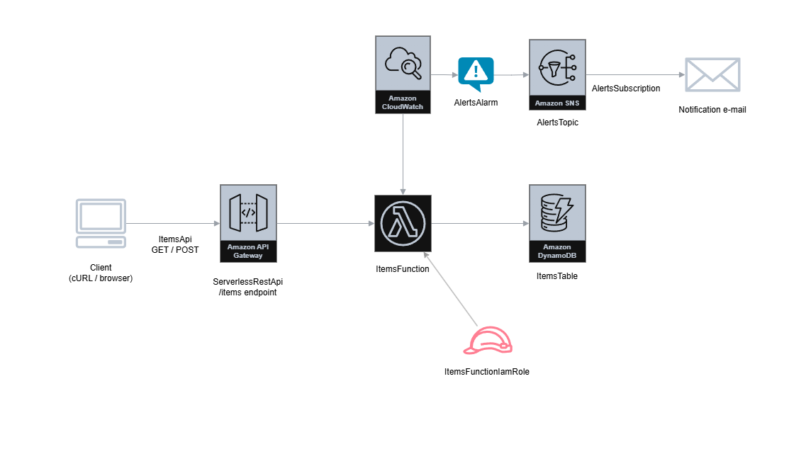

# portfolio-project-1

A basic REST API built with AWS serverless services, designed to store and retrieve items from a DynamoDB table. The stack includes Amazon API Gateway, AWS Lambda, and DynamoDB for the core functionality, plus a CloudWatch Alarm and SNS Topic for error monitoring and e-mail alerting.


## Architecture




## Technologies

**AWS Services**
- AWS Lambda (environment provided by AWS for Python 3.14)
- Amazon API Gateway
- Amazon DynamoDB
- Amazon CloudWatch
- Amazon SNS

**Infrastructure & Tooling**
- AWS SAM (Server Application Model)
- LocalStack (local AWS emulation)
- Docker


## Prerequisites

- [Docker Desktop + WSL] (https://www.docker.com/products/docker-desktop/)
- [Python 3.14+] (https://www.python.org/downloads/)
- [LocalStack CLI] (https://docs.localstack.cloud/aws/getting-started/installation/): create a free account to generate an auth token (https://docs.localstack.cloud/aws/getting-started/auth-token/). LocalStack can be installed with the command `pip install localstack`
- [AWS CLI V2] (https://docs.aws.amazon.com/cli/latest/userguide/getting-started-install.html) configured with a `localstack` profile
- [AWS SAM CLI] (https://docs.aws.amazon.com/serverless-application-model/latest/developerguide/install-sam-cli.html)
- [samlocal] (https://docs.localstack.cloud/aws/connecting/infrastructure-as-code/aws-sam/#samlocal-wrapper-script)


## Local setup with LocalStack

Follow these steps to deploy the application locally using LocalStack:

1. Clone this repository on your local machine.

2. Make sure Docker Desktop is running. Open a terminal and start LocalStack:

   ```powershell
   localstack start
   ```

   Wait until `Ready` appears in the output.

3. Create the S3 bucket that SAM uses to upload the deployment package:

   ```powershell
   aws s3 mb s3://awssamcli-managed-default --profile localstack
   ```

4. Open `samconfig.toml`, uncomment the `parameter_overrides` line and replace `#INSERT NOTIFICATION E-MAIL ADDRESS#` with your email address.

5. Build the project:

   ```powershell
   samlocal build
   ```

6. Deploy the stack:
   
   ```powershell
   samlocal deploy --config-env localstack
   ```

   When the deploy completes, the API endpoint URL is shown in the `Outputs` section under `ItemsApi`.


## Run the tests

### Prerequisites to run unit and integration tests
To execute all tests, it's necessary to install the Python libraries `pytest` and `boto3` with this command:

```powershell
pip install pytest boto3
```

### Run unit tests
Launch this command from the root folder of this project:

```powershell
python -m pytest tests/unit/ -v
```

### Run integration tests
To run the integration tests:

1. the application must be deployed and running on LocalStack

2. these environment variables must be defined:

   ```powershell
   $env:AWS_SAM_STACK_NAME = "portfolio-project-1"
   $env:CLOUDFORMATION_ENDPOINT = "http://localhost.localstack.cloud:4566"
   $env:AWS_PROFILE = "localstack"
   ```

3. run integration tests with this command from the root folder of this project:
   
   ```powershell
   python -m pytest tests/integration/ -v
   ```


## Deploy on AWS

*Coming soon — this section will be updated after the first AWS deployment.*


## Project structure

Here's a description of the folders and files present in the repository:

- **/docs**: contains the files used to build this README.

- **/events**: contains `event.json`, a sample API Gateway event used during local development with `sam local invoke`.

- **/items**: contains all the files needed by the Lambda function.
    - **app.py**: the Lambda function handler with the GET and POST logic.
    - **requirements.txt**: the Lambda function dependencies.

- **/tests**: contains unit and integration tests.
    - **/integration**: integration tests against LocalStack.
      - **test_api_gateway.py**: integration test suite for the API endpoints.
    - **/unit**: unit tests with mocked DynamoDB.
      - **test_handler.py**: unit test suite for the Lambda handler.
    - **requirements.txt**: test dependencies.

- **samconfig.toml**: SAM CLI configuration organized by command and environment.

- **template.yaml**: CloudFormation/SAM template that defines the entire infrastructure stack.